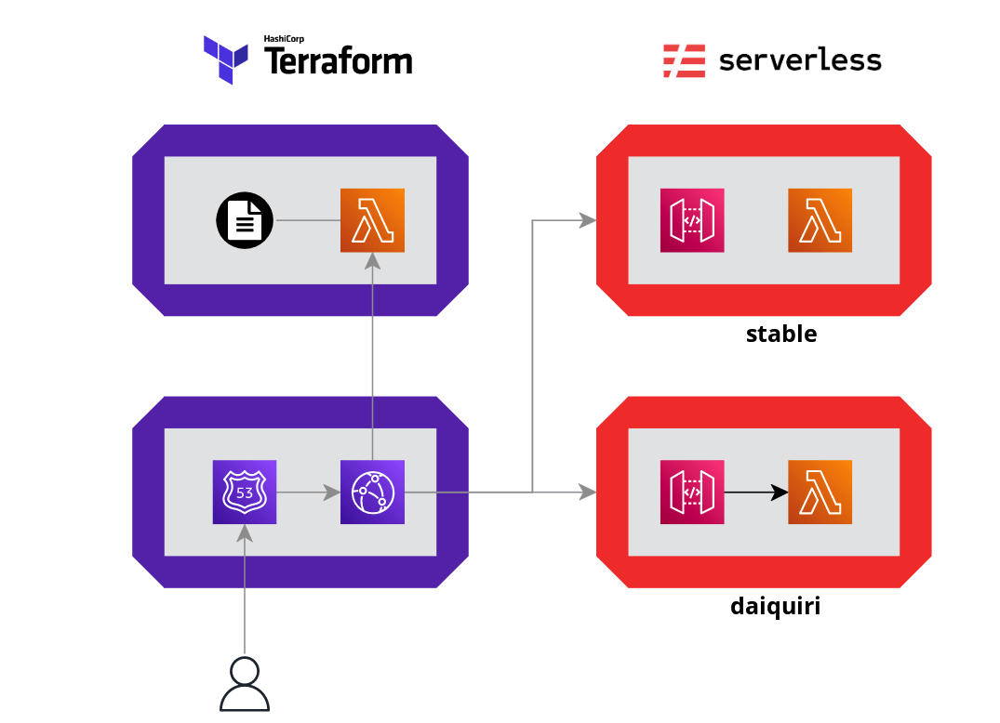

# Header-based API Gateway versioning with Cloudfront (powered by serverless and terraform)


* [Problem](#the-problem)
* [Architecture](#architecture)
* [Usage](#usage)


## The Problem

Let's assume we have an api

```
curl   https://d3ehik0tnv7107.cloudfront.net/ping
```

```
{
  "message": "ping function executed successfully!"
}
```

And that we would like to make changes to it and have those changes available for some api consumers but have the rest of consumers keeping getting the previuos version. 

So for example we would like to perform a request to the same endpoint but with and additional header that specifies which `version` we want

```
curl   https://d3ehik0tnv7107.cloudfront.net/ping  -H "api-version: daiquiri"
```

and get the changed version:

```
{
message: `Hey there, I'm the ping function and I executed successfully! (daiquiri)`
}
```

yes, daiquiri: in this prototype versions are named as cocktails. 


We also want the original request to keep ruturning the unchanged message: 

```
curl   https://d3ehik0tnv7107.cloudfront.net/ping
```

```
{
  "message": "ping function executed successfully!"
}
```

We would also like to be easy to dismiss a created version, i.e. remove its availability as well as all the resources associated to it in a one shot command. 

## Architecture

The starting point is an architecture similar to the one in the diagram below, where 

* Terraform manages the infrastructure that includes the CloudFront distribution and the DNS
* A Serveless application manages the API resources including the API Gateway and the Lambda functions that compose our service 


The two pieces are glued together by having `terraform` referencing the API Gateway that serverless create. 

`Serverless` makes very easy to deploy the same application to multiples `stages` and accomplish it by creating a new stack (the set of resources needed to provide the API) for each `stage` we deploy. 

We will leverage this to deploy multiples `versions` of the same application. 

We will do 

`serverless deploy --stage daiquiri`

to deploy te `daiquiri` version of the API. 

The missing piece is how to instruct CloudFront to route the request to one stack or the another based on the request header. To do this we need: 

* A new CloudFront origin for each new API Gateway that get created upon deploying the serveless application to the new stage (version)
* A Lambda@Edge function that has awareness of the existing `versions` and is capable of routing the request to the proper origin.

The resulting architecture is illustrated here: 




In this Architecture: 

* The user sends a request with `api-version` header set to the requested version (i.e. `daiquiry`)
* This request reaches the CloudFront distribution and triggers the Lambda@Edge Origin Request.
* The Lambda@Edge function uses the provided header value and fetches data a configuration file that  contains `mappings` for API versions. 
* The function then modifies the Origin and the Host header of the request and returns it back to CloudFront.
* CloudFront sends the request to the relevant Amazon API Gateway URL.

* If the user send the request without the `api-version` header set, the default (`stable`) origin will serve the request. 

* If the user send a request with the `api-version` header set to an invalid version will get a `403` response from the CloufFront distribution. 

Note: The solution was inspired by this blog post:

https://aws.amazon.com/blogs/compute/implementing-header-based-api-gateway-versioning-with-amazon-cloudfront/

## Usage

### Requirements

To run this project you will need: 

* terraform ~>1.3.0
* jq
* node 16.x

You also need acccess to an AWS account and have the credentials already configured as usual. 

### Setup 

In the root directory run 

```
npm ci
```

Then cd into the `infra` directory and run 

```
terraform init
terraform apply
```

### Available version

In this prototype the available versions are stored in a `versions.auto.tfvars.json` file that get updated whenever a new version is created or removed. 

To access the available versions you can run 

```
npm run versions
```


```
[
  "mojito",
  "stable",
]
```

There are two versions deployed, `stable` and `mojito`. 

### Serve the "daiquiri" version

Let's assume we did some changes to the API code and we would like to deploy them to a new `daiquiri` version. 

We need to execute the `serve.sh` script with the new version name as argument

```
./serve.sh daiquiri
```

The script will: 

* Deploy the api to the `daiquiri` stage (this will deploy a new API Gateway and Lambda function by running `serverless deploy --stage daiquiri`) 
* update the `versions.auto.tfvars.json` file with the new version 
* apply the neeeded terraform changes to make the versions available through CloufFront


### Consume the "daiquiri" version

```
curl   https://d3ehik0tnv7107.cloudfront.net/ping  -H "api-version: daiquiri"
```

```
{
  "message": "Hey there, I'm the ping function and I executed successfully! (daiquiri)"
}
```

### Forget the "daiquiri" version

Let's assume we want to get rid of the `daiquiri` version and all its associated resources. 

We will execture

```
./forget.sh daiquiri
```

This will: 

* remove the stack associated to this version (`serverless remove --stage mojito`)
* remove the version from `versions.auto.tfvars.json`
* apply the terraform changes needed to remove the availability of this version.
